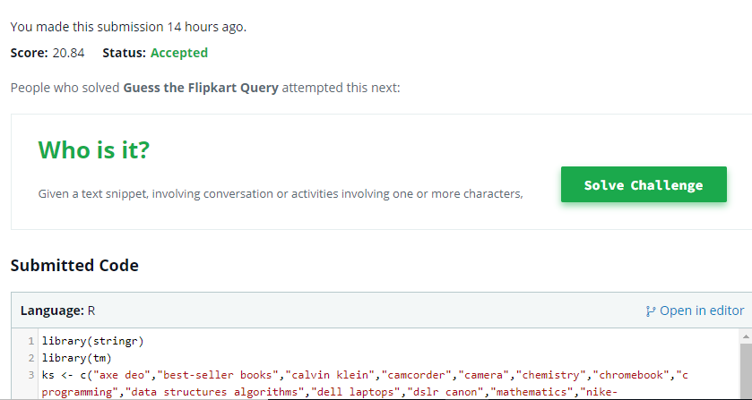
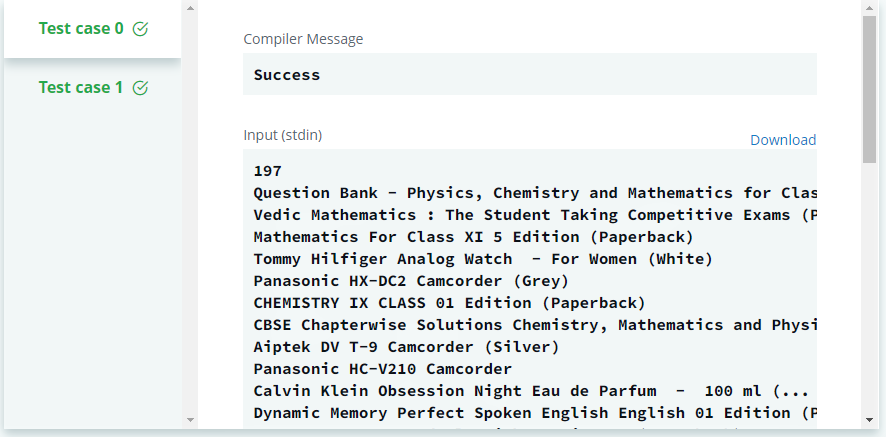
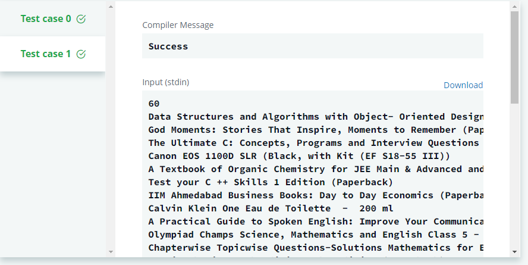

# Guess the Flipkart Query
Submission #1

[Hackerrank Submission](https://www.hackerrank.com/challenges/guess-the-flipkart-query/submissions/code/96255651)

This program checks if the input search string provided by the user contains any of the keys as substring.

The step by step implementation is:

* Clean the input by converting eveything to small letters, remove stopwords and punctuations, and squishing any extra space that may have appeared as result of above.

* It is checked if the input string contains any one of the 20 keys directly. If its true, then a score of 100 is assigned to that key for the string.

* Now, it is checked if the input string contains any of the substring of keys. 10 points are awarded for every such occurence.

* The value with maximum score as a result of above operations is given out as the output.