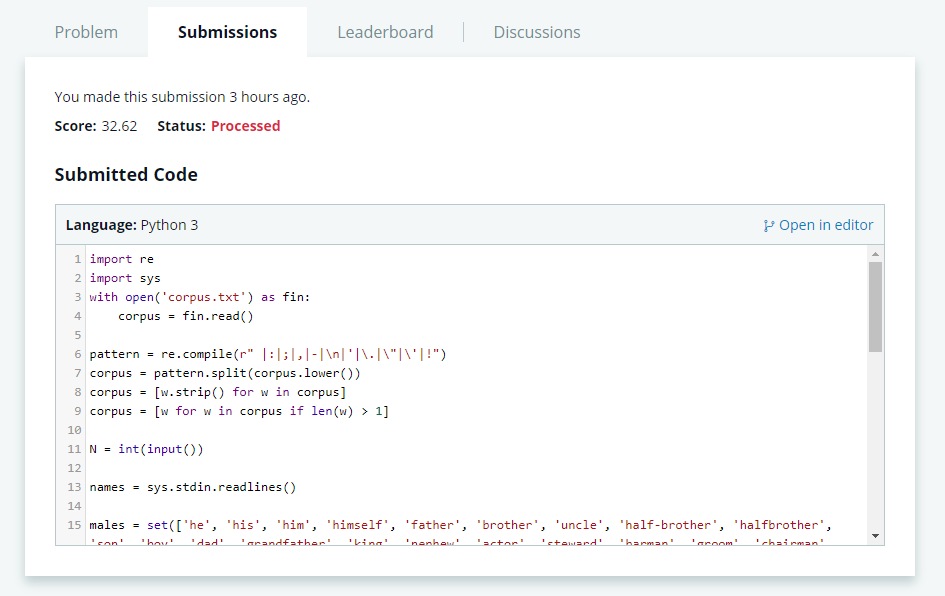

## Problem Statement 2

Guess the gender of a character from a corpus of text.

### Solution Approach

Check the sentences surrounding the character name to identify nouns or pronouns that hint at the gender of the character.

The detailed solution is available [here](Question2.py)

Hackerrank Submission Result:

